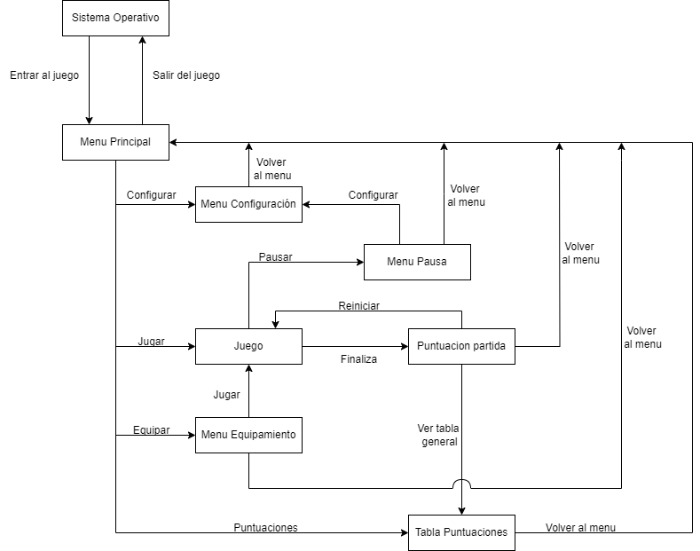

# PROYECTO CON UNITY: HUNTING SIMULACRUM
## Contenido del repositorio:
Este repositorio contiene todos los recursos y paquetes que hemos utilizado para crear nuestro juego "Hunting Simulacrum".

## Tecnologias Utilizadas:
* Unity
* C#
* Newtonsoft JSON (Paquete de C#)
* Nav Mesh (Paquete de Unity)

## Instruccion de uso:

Hemos intentado seguir fielmente el diagrama de escenas que creamos previamente.

1. Al ejecutar nuestra aplicación "juego", primero nos llevará a su Menu Principal, desde aqui podemos acceder a 5 pantallas:

    * Configuración: Aqui podremos configurar los ajustes, como por ejemplo, el sonido de la música, la calidad, activar pantalla completa, etc.
    * Empezar partida: Nos llevaria a la partida y, por lo tanto, ya podriamos jugar.
    * Equipamiento: Aqui podremos cambiar el armamento de nuestro personaje.
    * Puntuacion Personal: Aqui veremos nuestra puntuación de cada partida, peró para acceder a ello es obligatorio que el jugador este conectado a una cuenta que este registrado.
    * Iniciar sesión / cerrar sesión: Si el jugador no esta conectado a ninguna cuenta, saldra la opcion de iniciar sesión y en caso contrario cerrar sesión.
    * Salir: Sale de la aplicación

2. Una vez que estamos en "Configuración", también tenemos la opción de volver atrás.
3. Una vez en "Equipamiento", podemos o volver al menu principal o iniciar la partida desde alli.
4. Una vez en la tabla de puntuaciones, también podemos volver al menu principal.
5. Desde el menu de iniciar sesión, podemos o bien iniciar sesión (conectando a una cuenta) o registraros, que en teoria nos llevaria a la pagina web para poder crear un nuevo usuario (este opción solo esta disponible si la pagina web esta activa).
6. En la partida, podemos acceder al menu de pausa pulsando la tecla "ESC", y si se finaliza la partida, ya sea victoria o derrota, saltara una pestaña con los resultados de la partida:
    * Pausa: En el menu de pausa podemos acceder a la configuración del juego, volver a la partida y salir de la partida.
    * Resultados: En cuanto nos muestren los resultados podemos escoger entre volver a jugar, ver todas las puntuaciones o volver al menu principal.

## Durante la partida:
Todas las especificaciones de los comportamientos de los personajes y mecanicas del juego, estan detalladamente en el Game Design Document.

[Hunting Simulacrum - Game Design Document](https://docs.google.com/document/d/12bcAviPD4JIiVNPataQmTY3hzCJryznTPjmvyb3VB4o/edit?usp=sharing)

## Otros repositorios relacionados
[KillerRobot_Web](https://github.com/jordisanchoitb/KillerRobot_Web)  
[KillerRobot_Api](https://github.com/jordisanchoitb/KillerRobot_Api)